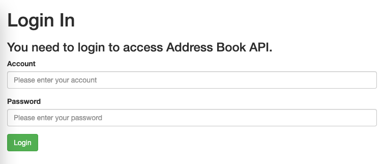
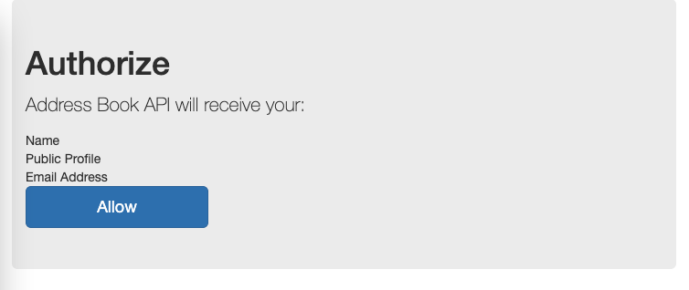
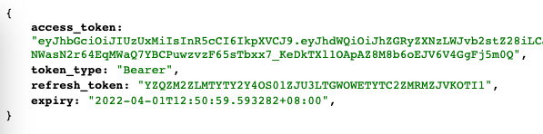
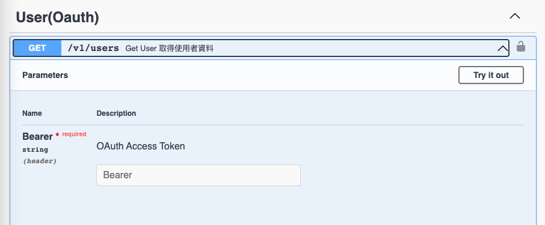
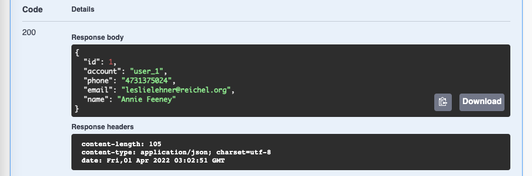

# oauth2-server-go

這是一個 Oauth2 Server 實作的練習，參考 [go-oauth2/oauth2](https://github.com/go-oauth2/oauth2) 的範例，實作的是 Authorization Code Flow，並以 mysql 來儲存 client 及 scope 等資料。

## 感謝

`Oauth2-server-go` 參照 [Rainlay](https://github.com/rainlay) 過去的開發專案，其中 [go-oauth2-xorm](https://github.com/rainlay/go-oauth2-xorm) 已經被加入 [go-oauth2/oauth2](https://github.com/go-oauth2/oauth2) 的 文件中，透過實作了解 Oauth Authorization Code Flow 的運作機制，獲益良多。

## Oauth Authorization Code Flow


(image from [https://auth0.com/docs/](https://auth0.com/docs/get-started/authentication-and-authorization-flow/authorization-code-flow))

## Related tables

### Oauth Client

紀錄 Client app 的資料，包含名稱、密鑰、授權的 api、允許的授權的網域、app icon。

| Field          |     Type     |      Comment       |
| -------------- | :----------: | :----------------: |
| id             | VARCHAR(255) |         id         |
| sys_account_id |   int(11)    |     manager id     |
| name           | VARCHAR(255) |        name        |
| secret         | VARCHAR(255) |   client secret    |
| domain         | VARCHAR(255) |       domain       |
| scope          | VARCHAR(255) |     allow apis     |
| icon_path      | VARCHAR(255) |   app icon path    |
| data           |     TEXT     | for oauth2 library |
| created_at     |   datetime   |                    |
| updated_at     |   datetime   |                    |

### Oauth Scope

紀錄開放 api 的資料，包含名稱、路徑、方法。

| Field       |     Type     |        Comment        |
| ----------- | :----------: | :-------------------: |
| id          |   int(11)    |          id           |
| scope       | VARCHAR(100) |  scope label(unique)  |
| path        | varchar(100) | api path(casbin rule) |
| method      | VARCHAR(20)  |      http method      |
| name        | VARCHAR(100) |     display name      |
| description | VARCHAR(255) |      description      |
| is_disable  |  tinyint(4)  |                       |
| created_at  |   datetime   |                       |
| updated_at  |   datetime   |                       |

### Oauth Token

紀錄使用 oauth 服務的 token 狀態。

| Field      |     Type      |       Comment       |
| ---------- | :-----------: | :-----------------: |
| id         |    int(10)    |         id          |
| code       | varchar(255)  | authentication code |
| access     | varchar(255)  |                     |
| refresh    | varchar(255)  |    refesh token     |
| expired_at |    int(11)    |     expire time     |
| data       | VARCHAR(2048) |                     |

## Structure

### Oauth library

1. InitOauth2

   初始化 [go-oauth2/oauth2](https://github.com/go-oauth2/oauth2) module

   - 設定 client 資料存放位置
   - 設定 token 資料存放位置
   - 設定 userAuthorizeHandler，統一處理目前 oauth 步驟進行的狀態，將網頁引導至對應的位置。
   - 設定 authorizeScopeHandler，在使用者同意授權後，將此次請求的 scope 權限和該 client app 已經允許的授權進行比對，檢查請求的授權是否都在範圍內。

2. Validation

   從 ReturnUri 取得資料，檢查 client 的資料，確保進入授權頁面時資料遺失。

3. Scope

   提供 scope 轉換的機制，從 string 轉成 JSON 格式，方便檢查授權使用。

### Oauth xorm

[go-oauth2/oauth2](https://github.com/go-oauth2/oauth2) 提供多種儲存方式，這次是以以 mysql 來儲存 client 及 scope 等資料，使用 [go-oauth2-xorm](https://github.com/rainlay/go-oauth2-xorm) 來改寫。

### Authentication Web

1. LoginHandler

   負責處理載入登入頁面前的驗證，以及網頁頁面所需的資料。使用者在此頁面輸入帳號密碼。

2. AuthHandler

   使用者在帳號密碼輸入完畢並驗證成功後，負責處理載入授權頁面前的驗證，以及網頁頁面所需的資料。

### Authentication API

1. UserAuthorizeHandler

   搭配 oauth/library/userAuthorizeHandler，統一處理目前 oauth 步驟進行的狀態，將網頁引導至對應的位置。

2. LoginHandler

   處理使用者登入，檢查 user 是否存在以及密碼是否正確，若是正確，則導到網頁授權頁面(web AuthHandler)；若是錯誤，則返回登入頁面(web LoginHandler)，並告知帳號密碼輸入錯誤。

3. UserAuthHandler

   處理使用者按下授權後，將授權狀態保存並導至 api UserAuthorizeHandler，檢查 client 以及 scope 授權，確認無誤後發給 token 回傳。

4. TokenHandler

   處理 refresh token 的請求。

### Oauth token middleware

- 檢查 oauth token 的合法性
- 檢查此次呼叫的 api 是否在 client 的授權 scope 內。
- 從 oauth token 取得 Subject 和 Audience

  ```
  claims.Audience: client app id
  claims.Subject : user account
  ```

## Test environment

### Oauth client

1. 使用 [go-oauth2/oauth2](https://github.com/go-oauth2/oauth2) 的 example/client 來模擬 client app，修改 config。

   ```go
   const (
       authServerURL = "http://localhost:8080"
   )

   var (
       config = oauth2.Config{
           ClientID:     "address-book-go",
           ClientSecret: "address-book-secret",
           Scopes:       []string{"user"},
           RedirectURL:  "http://localhost:9094/oauth2",
           Endpoint: oauth2.Endpoint{
               AuthURL:  authServerURL + "/oauth/authorize",
               TokenURL: authServerURL + "/oauth/token",
           },
       }
       globalToken *oauth2.Token // Non-concurrent security
   )
   ```

2. 執行後，使用瀏覽器打開 [http://localhost:9094/](http://localhost:9094/)，就能進入驗證流程。

   

   預設的帳號密碼資訊如下

   ```
   account : user_1
   password: A12345678
   ```

3. 帳號密碼輸入正確，使用者身分驗證成功後，會跳轉至授權頁面。

   

4. 按下同意授權後，系統會比對此次申請的 scope 與 client app 所授權的 scope 是否符合。確認完成後，會回傳 token 等驗證資訊。

   

5. 前往 [Swagger document](http://localhost:8080/swagger/index.html)，使用 access_token 來取得 user 資料。

   

   

6. 使用瀏覽器打開 [http://localhost:9094/refresh](http://localhost:9094/refresh) ，透過 refresh 機制來取得新的 token。

## Oauth Scope Handling

假定目前有一個 app 想要取得 使用者資料 以及 聯絡人資料，但是並沒有新增的權限，scope 的處理方式如下。

1. 從 oauth_client 取得 client app 的資料，並從 scope 取得列表。

   | Scope                     | Authorized |
   | ------------------------- | :--------: |
   | user.profile_get          |    Yes     |
   | address-book.list_get     |    Yes     |
   | address-book.contact_post |     No     |
   | address-book.contact_get  |    Yes     |

2. 從 oauth_scope 取得所有的 scope 列表，建成樹狀表單，搭配從 client app 取得的授權資料，生成 client app 的 scope tree。

   Scope List

   - user
     - user.profile_get
   - address-book
     - address-book.list_get
     - address-book.contact_post
     - address-book.contact_get

   Scope list in JSON

   ```JSON
   {
    "address-book": {
        "name": "address-book",
        "items": {
            "contact_get": {
                "name": "contact_get",
                "is_auth": true
            },
            "contact_post": {
                "name": "contact_post",
                "is_auth": false
            },
            "list_get": {
                "name": "list_get",
                "is_auth": true
            }
        },
        "is_auth": false
    },
    "user": {
        "name": "user",
        "items": {
            "profile_get": {
                "name": "profile_get",
                "is_auth": true
            }
        },
        "is_auth": false
    }
   }
   ```

3. Scope validation flow

   ```
    Oauth2Middleware
        1. check token, get claims
        2. check scope
            a. find scope by path
            b. verify scope is authorized
                - get scope tree from redis
                - if scope tree not found from redis, build one by mysql data)
                - check scope
   ```

## GO

### 套件管理 Go Module

專案目前使用 Go Module 進行管理，Go 1.11 版本以上才有支援。

#### Go Module

先下指令 `go env` 確認 go module 環境變數是否為 `on`

如果不等於 `on` 的話，下指令

```
export GO111MODULE=on
```

即可打開 go module 的功能。

原則上專案編譯時會自行安裝相關套件，

但也可以先執行下列指令，安裝 module 套件。

```
go mod tidy
```

### How to set up environment?

安裝 docker 後，使用 `docker-compose.yml` 來建立 mysql、redis

```bash
docker-compose up -d
```

並參考 `.env.sample` 來設置 `.env`

### How to do DB migration?

我們使用 sql-migrate 套件實作 DB migration 功能，

先進行 cmd 安裝

```bash
go get -v github.com/rubenv/sql-migrate/...
```

指令如下：

執行 Migration

```bash
make migrate-up
```

Rollback Migration

```bash
make migrate-down
```

套件連結： Please refer [sql-migrate](https://github.com/rubenv/sql-migrate)

### How to develop?

```shell
go install
go run main.go
```

## Swagger API Doc

先進行 cmd 安裝

```bash
go get -u github.com/swaggo/swag/cmd/swag
```

1. 產生文件

可以經由 Makefile 執行

```bash
make doc
```

或者原生指令

```bash
swag init
```

2. And then you take [Swagger document](http://localhost:8080/swagger/index.html)
